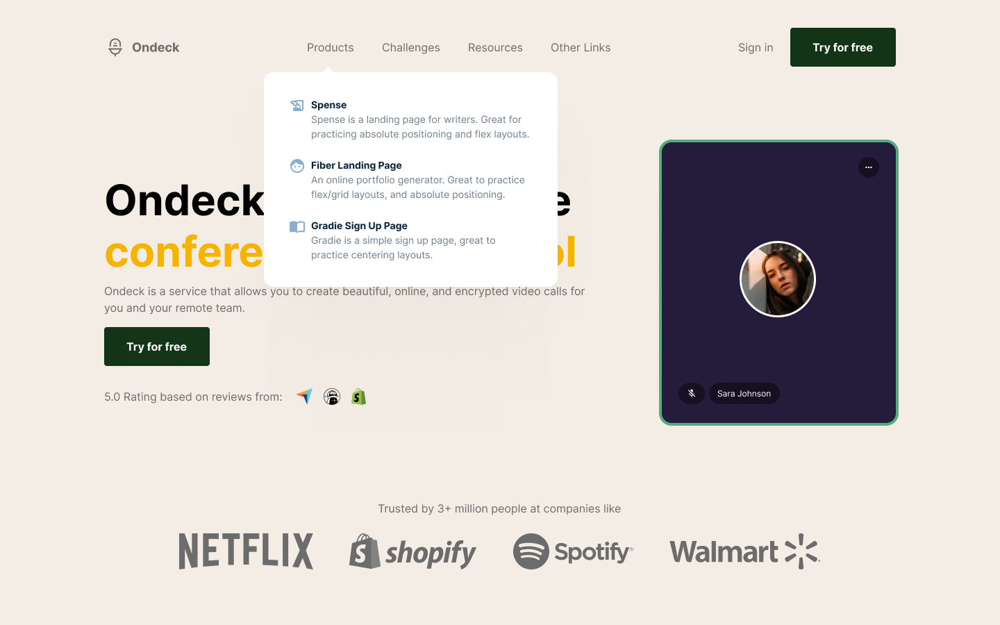

<h1 align="center">
    <a href="https://Ondeck.luisnunes.me/">🔗 Ondeck</a>
</h1>

<p align="center">Site de chamadas de vídeos  remota</p>

<p align="center">
  
  
  
</p>

<h4 align="center"> 
	Constrindo
</h4>

<p align="center">
 <a href="#Technologies">Technologies</a> •
 <a href="#Getting-started">Getting started</a> •
 <a href="#autor">Autor</a>
</p>




## Technologies

This project was developed using the following technologies:

- SASS
- JS


## Getting started

Clone the project and access the folder.

```bash
$ https://github.com/Luis-Felipe-N/ondeck.git
$ cd ondeck
```

Use the extension 'Liver server' to run app in http://127.0.0.1:5500/index.html.

## Autor
---

<p align="center" href="https://blog.rocketseat.com.br/author/thiago/">
 
 <br />
 <sub><b>Luis Felipe</b></sub></a> <a href="https://luisnunes.me" title="Luis Felipe Nunes de Carvalho">🚀</p>


<p align="center" >Feito com ❤️ por Luis Felipe</p>